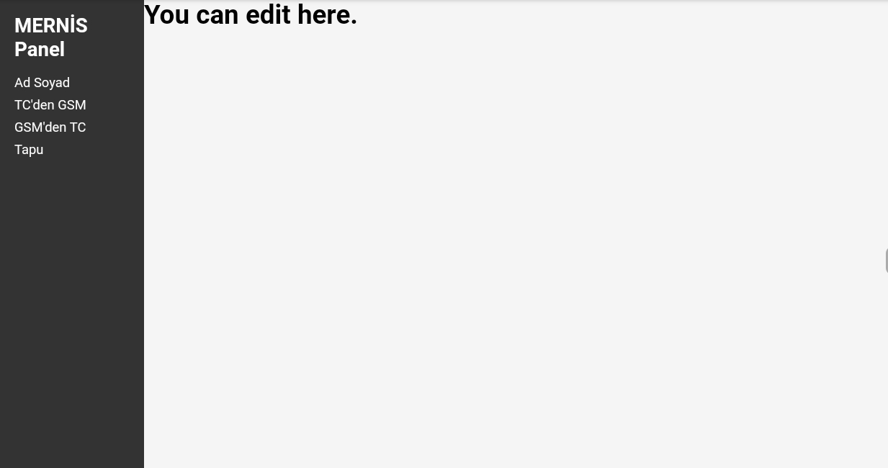

# Mernis Panel Template

This is a Mernis panel template created using HTML, CSS, and JavaScript. It includes a login page and panel.

## Preview

## Getting Started

To get started with this template, simply download the files and open `index.html` in your web browser.

## Usage

### Login

Use the login form on the homepage to log in to the Mernis panel without Key. You can add key with Javascript.

### Pages

I didn't add anything to the pages, you can add.

## Customization

This template can be customized to fit your specific needs. Simply modify the HTML, CSS, and JavaScript files as necessary.
